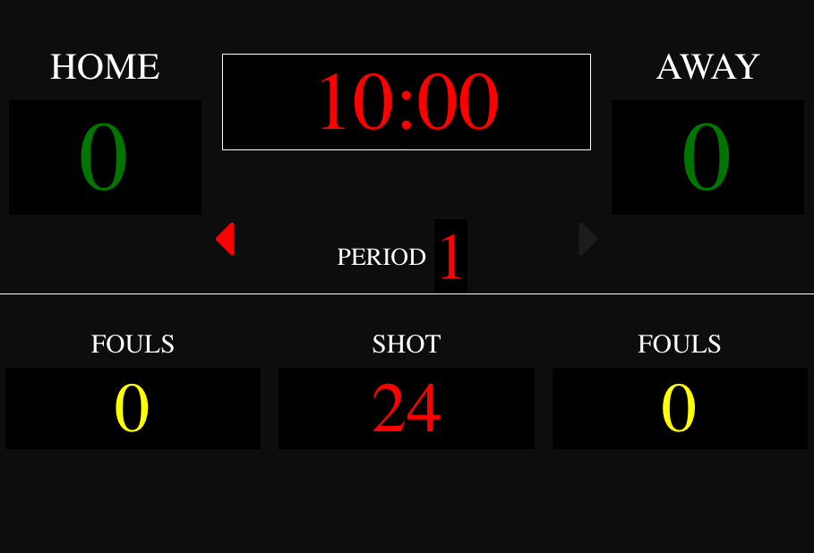

# bball-vista: A Basketball Scoreboard

This web app can be chromecasted to a screen in your hall. At the moment, you interact with it by pressing right/left on scores, fouls, shot clock, etc.

To reset how many minutes per period, go back to the main page (https://bball-vista.web.app) and adjust minutes per period.

Eventually, it will support a separate control window (using phones, for instance).

Please register issues here on Github!

